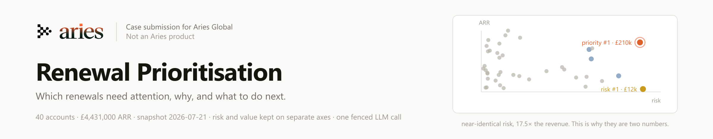

# Renewal Prioritisation

A tool for a customer success manager deciding **which renewals need attention, why, and what to do next.**

| | |
|---|---|
| **Live app** | https://renewal-prioritisation.vercel.app |
| **Repository** | https://github.com/simerugby/renewal-prioritisation |
| **Working and measurements** | [EVIDENCE.md](EVIDENCE.md) |
| **60-second walkthrough** | https://youtu.be/yO9A3nfCMa8 |
| **The nine weights, in the app** | https://renewal-prioritisation.vercel.app/method |

Built on the supplied `renewal_customers.csv`: 40 synthetic accounts, £4,431,000 of ARR, snapshot
dated 2026-07-21. The app is four pages: a ranked portfolio table, an account page per customer showing
every signal that fired and the rule behind its suggested action, a method page with the weights and
the curves, and `/try` for running your own CSV.

---

## Who I would prioritise first

**Northstar Logistics.** £210,000, renewing in 18 days, and the only account where every axis agrees.
Active users fell 48% in a month (612 → 318), the invoice is disputed, the sponsor left in June, no
contact for 71 days, renewal process not started. It ranks first on priority and second on risk,
behind a £12,000 account in even worse shape that should still not be the first call. That is finding 2.

Then Meridian Health Systems (£180k, usage −38%, four critical tickets), Lantern Hospitality (£68k,
has asked for a cancellation clause), Atlas Manufacturing (£140k, caught in a vendor consolidation),
and Oakwell Design (£12k, the most distressed account in the book).

Every account also carries a suggested next action, picked by a 17-rule decision table
(`lib/playbook.ts`) rather than by a model, with the rule that fired named on the page: 7 accounts on
*Today*, 15 on *This week*. First match wins, and on Northstar that ordering is wrong. The disputed
invoice outranks the dead renewal process, so the action reads *resolve the billing dispute* on an
account whose easiest problem to fix is that nobody has opened the renewal conversation with 18 days left. An
account with five things wrong at once should render every rule that fired, not the first.

---

## Five findings

Each account carries a **risk** score out of 100. It is a rubric, not a fitted model: nine weighted
signals, adoption trend 18, renewal process readiness 16, engagement recency 14, seat utilisation 12,
executive sponsor 12, billing status 12, support strain 8, sentiment 5, prior discount pressure 3.
65 and above reads *Critical*, 45 and above *Elevated*, 25 and above *Watch*, below that *Stable*. **Priority**
runs on the same 0–100 scale, and finding 2 is why both stay on the page.

### 1. The near-term risk is process, not product

£817,000 renews within 30 days. Four accounts worth **£385,000** renew within 45 days with the stage
still at *Not started*, three of them inside 30 days. That is the cheapest risk on the board. Nothing is wrong with those customers;
we simply have not opened the conversation.

So the rubric weights *renewal process readiness* at 16 of 100, second only to adoption, and compares
the stage reached against the time remaining. "Not started" is unremarkable at 120 days and an
emergency at 18.

### 2. The most at-risk account is worth £12,000, and should not be the first call

**Oakwell Design** ranks **#1 on risk**: users down 82%, 3 of 25 seats active, NPS −42, 120 days
since contact, champion gone. It is worth £12,000. **Northstar** has the same pathology at **17.5×**
the value.

A single blended health score sends the CSM to Oakwell. So the app keeps two numbers on the page and
never collapses them into one health score. **Risk** asks whether the account is in trouble.
**Priority** is that risk multiplied by value at stake (ARR against the book's 90th percentile) and
by how soon the renewal lands. Risk stays beside it in a `vs risk` column so you can always see what
the multiplication did to it; the scatter shows the same thing in one glance.

Oakwell falls to **priority #5**, still visible and no longer first. That position is a judgement rather
than a fact: a value floor of 0.45 in `lib/config.ts` decides how much a small account is allowed to
matter, and jittering it ±40% moves Oakwell between #2 and #6. Straight expected loss (risk × ARR ×
urgency, no floor) is a defensible ranking. It puts Oakwell at #20, thirteen days from its own
renewal, below nineteen accounts in better shape. I would want an operator to argue with that floor rather
than inherit it. `npm run sensitivity` sweeps it end to end.

The value reference is the portfolio's 90th percentile of ARR, derived at load time rather than
hard-coded, so the rubric behaves sensibly on a book of £20k SMBs and a book of £5m enterprises alike.

### 3. NPS is the least trustworthy column, and the one CS teams lead with

| | |
|---|---|
| Accounts with no usable NPS (two blank, one undated) | 3 |
| Of the 37 dated responses, older than a week | **36** |
| Median age | **43 days** · oldest **238** |
| Accounts with usage data over a week stale | **4** (median sync age: 1 day) |

Sentiment is stale almost everywhere; behaviour is fresh almost everywhere. So adoption is weighted 18
and sentiment 5, sentiment halves past 45 days, and **drops out entirely past 120**, which excludes
7 accounts' NPS from scoring.

Excluded signals are not scored as zero. Their weight is removed and the rest re-normalise, so an
account measured on 51% of the rubric's weight sits on the same 0–100 scale as one on 100%. The honest response
to a 238-day-old data point is to drop it and name the gap, not to average it in.

Confidence is shown separately and never folded into risk. It drops when more than 5% of the rubric's
weight is missing, when the usage feed is stale, or when two signals contradict each other. Sentiment
is 5 of those 100 points, so dropping it on its own leaves 95% of the weight applied. That is not
enough to move an account off **High confidence**: Everfield Agriculture still reads High with its 238-day NPS excluded
and named on the page.

The same rule applies to usage. **Stonebridge Education** (£95,000, renewing in 25 days) last synced
33 days before the snapshot, so its "last 30 days" figures describe a window that closed a month
earlier. Both usage signals are excluded on that basis, and its engagement date and NPS are blank in the
source, so four of the nine signals carry no weight and it is scored on **51% of the rubric**. The app
shows a risk of 46.2 next to that coverage figure and a **Low** confidence flag, rather than the number
on its own.

### 4. "Verbal commitment" is not a safe stage: three of four are stuck on money

| Account | ARR | Invoice |
|---|---|---|
| Greenway Bank | £240,000 | **Disputed** |
| BluePeak Software | £84,000 | **Overdue** |
| Meadow Homeware | £28,000 | **Overdue** |
| Mosaic Foods | £56,000 | Current |

**£352,000 sits in the most reassuring stage in the CRM with unresolved billing underneath it.**
Greenway reads as healthy on every behavioural signal (NPS 61, usage up 8%) while the order form is
unsigned and finance disputes a services charge.

The app does not resolve this. Picking a side invents a fact, and either record could be the stale one.
It flags the contradiction and lowers confidence, and the score itself takes both records at face value
at once: full credit for the verbal commitment, full penalty for the disputed invoice. That penalty is
12.6 of Greenway's 13.5 risk points, so almost all of its risk is the billing record and none of it is
behaviour. That is why it reads 13.5 with a contradiction beside it rather than a higher
number with the disagreement buried inside it, and why both records are printed side by side for a
human to settle with one call.

### 5. The rules I wrote score 95% here and 7% when the wording changes

The nine signals cannot read `customer_notes`, and that column carries facts that change the answer.

The sharpest case: **Quantum Public Sector**, the **largest account at £260,000**, renewing in 30 days.
Usage growing, NPS 46, funding approved, invoice current. It scores **14.9** on risk and ranks **#15** on priority. The
note reads *"the original sponsor moves roles on 1 August and no replacement is recorded."*

Before reaching for a model I wrote a keyword scanner and measured it, because "an LLM would be better
here" is an assertion until tested. It caught **36 of 38** hand-labelled note risks and raised nothing
on the two notes I labelled as carrying no extra risk, which looked like an argument for deleting the
API call. It is not, and the weaker half is the second one: those two notes are the only place in the
set where a false positive could be recorded at all. On six of the other 38 the scanner raised a second
category on top of the one I labelled, and the count took the hit without ever judging that second
flag. `npm run verify` now prints those six.

One of my labels was also imprecise. Atlas Manufacturing's note says an internal owner exists but has
not decided which tools stay. That is an undecided blocker rather than an unowned one, so the label now
reads "Unowned or undecided blocker".

The 36 of 38 is contaminated too: **I wrote those keyword rules after reading all forty notes.** So I
rewrote 14 of the same facts as another team would phrase them and re-ran:

| Detected the risk in the note | supplied notes (n=38) | same facts, reworded (n=14) | a book never seen (n=4) |
|---|---|---|---|
| Keyword rules | **95%** | **7%** | **1 of 4** |
| `gpt-4.1-nano` | 92% | **93%** | **3 of 4** |

Read the middle column the way you read the first. I wrote those 14 paraphrases knowing what the
regexes match on, so that set is biased against the rules exactly as the supplied notes are biased for
them; `npm run eval` prints that warning above its own output. The two rows are also not the same
measurement: the keyword row asks whether the scanner produced the *right category*, the model row
only whether it flagged the note at all. On exact category the model scores 45%, which is why it
categorises nothing in the shipped product and only decides whether a note is worth reading. That
distinction changes nothing on the reworded set, where the rules raise no flag of any kind on 13 of the 14.
Neither end of this table is a measurement. The gap between them is.

The third column comes from a second company's export with notes in a different register (*"practice
manager retiring in sept, no handover planned yet"*). Read it carefully: **I wrote that fixture and
its labels**, so it is not unseen data. What it does show is that nothing in the *system* was adjusted
for it: same prompt template, same regexes, same validators.

**Said plainly: on the forty notes you supplied the rules beat the model, and if this file were the
whole world I would delete the API call.** It earns its place because company number eleven writes its
notes differently and nobody is going to rewrite the regexes.

Full methodology, including where my own measurements were wrong twice, is in
[EVIDENCE.md](EVIDENCE.md).

---

## How I made the key decisions

| Decision | Why | What I gave up |
|---|---|---|
| **A transparent rubric, not a fitted model** | No historical renewal outcomes exist in this file. Nothing to fit, nothing to validate. A model here would be a confident number with no evidence under it, which is the brief's own point about churn probabilities. | Any claim to predictive accuracy. In exchange every point is inspectable. |
| **Risk and priority both stay on the page** | "Risk *and* commercial priority" is two questions. Priority does multiply risk by value and urgency; what it must not do is replace risk with a single health score. Finding 2 is what happens when one number answers both. | Two numbers to explain. The `vs risk` column pays that cost. |
| **Confidence as a third, separate output** | Folding staleness into the score silently converts a guess into a measurement. | Users read two things. It is the only treatment of stale data that does not quietly lie. |
| **Stale signals dropped, rubric re-normalised** | A 238-day-old NPS is not evidence about today, and neither is a usage window that closed a month ago. | An account on 51% of the rubric is not strictly comparable to one on 100%. That figure is therefore shown. |
| **Contradictions lower confidence, never risk** | Resolving them silently, in either direction, invents a fact. | The app declines to answer the hardest cases. That *is* the answer. |
| **Next action by decision table, not by model** | Routing attention is a small, knowable answer space. A rule can be read and argued with. | Less fluent phrasing than a model would produce. |
| **One LLM call, and it cannot move a number** | The score is computed server-side and never reaches the prompt: not the number, not the band, not the rank. It reads the note independently rather than reasoning toward a total it has already been shown. | The insight is ignorable, and that is the trade I want. An unreproducible output must not reorder a work queue. |
| **The triage list stays deterministic** | The triage list is the set of accounts whose *note* carries risk the nine signals cannot see. Measured, not assumed, and on a different question from the 95% in finding 5: not "did the scanner spot the labelled risk" but "does this note add risk the signals already carry". On that question, across the whole book, the rules run at 71% precision and 48% recall and the model at 67% and 80%. Applied to the 28 accounts scoring under 45 on risk, the rules select 9 and the model 19, and a list of 19 is not a list. Both catch Quantum on this file, the rules by matching "no replacement", which is this company's phrasing rather than a general one, and that is the whole difference between them. | The model's better recall. It reads the note instead. |
| **Everything anchors to the stated 2026-07-21 snapshot** | Using `new Date()` would make "18 days to renewal" drift daily and no figure here would reproduce. | The app is not live. It is honest about being a snapshot. |

**On cost.** One call per account, on demand. Never on page load, never looped over the portfolio.
Capped at 600 output tokens, cached per account, and rate limited to 40 calls per IP per 10 minutes so
a public URL cannot casually run up your bill. That limit is in-memory and therefore per instance, so
on serverless the real ceiling is the limit times the number of warm instances. It is a bound rather than a
guarantee, and `lib/rateLimit.ts` says so where the code is. The model is `gpt-4.1-nano`, chosen by
your key rather than by me: it is scoped to exactly one model, which I found by asking the API rather
than guessing. My first
deploy requested `gpt-4o-mini`, got a 403, and the app served the deterministic result with a visible
note instead of an error, the fallback proving itself in production before any reviewer saw it.

The insight panel on the account page, the only place model output appears, also prints what
validation rejected, and counting those was worth more than reading the outputs. A first batch showed 42 rejections across the book. Nineteen came from one bug: my prompt numbered
the note's clauses from 0 and the model answered numbering them from 1. Fixing the prompt took the batch to zero, and a second branch
that survived validation once in twenty-three tries was cut rather than shipped as noise. `EVIDENCE.md`
has the counts.

---

## What could change these decisions, and what I would ask in week one

- **Historical renewal outcomes.** The single input that would change the most. With two years of
  labelled outcomes I would fit a model, keep the rubric as the explanation layer, and finally know
  whether these nine signals predict anything. Nobody can say that today.
- **The weights are judgement, not evidence**, but not arbitrary, and I tested that rather than
  claiming it. Jitter all nine weights ±40% across 1,000 trials and the top 5 holds **100%** of the time, and
  deleting any single signal leaves it unchanged. The same test shows accounts in ranks 16–30 move up
  to **6 places**, so the middle of the list is a range, not an ordering. The app's method page says the
  same thing where a CSM will see it. The value floor in finding 2 is a separate constant that this
  weight jitter never touches, which is why it can move Oakwell out of the top 5 when this cannot.
- **Whether `renewal_stage` is ordered.** 16 of 100 weight rests on treating those five values as a
  progression. If a company uses them as unordered categories, that signal is meaningless.
- **What counts as engagement.** If a CRM logs email but not calls, silence is overstated and that
  signal inflates risk across the whole book.
- **When the customer can actually leave.** The file has a renewal date and a contract term, and no
  notice period, no auto-renewal flag and no opt-out date. In most B2B contracts the deadline that
  matters is the notice deadline, 30 to 90 days ahead of the renewal, and it inverts the picture: if
  Northstar's 12-month contract carries 30 days' notice, the window to cancel closed twelve days before
  this snapshot and the conversation is about terms rather than survival. It also separates the
  motions: an auto-renewing 36-month contract needs a different play from a live annual negotiation,
  and today they sort together. I ranked on the renewal date because it is what I was given, and this
  is the assumption I would test first.
- **Whether a decline is real, and what the decision table does with it.** Everfield's note says usage
  always falls during a seasonal shutdown and no prior-year baseline exists; Harbor Retail's decline is
  store closures. The rubric penalises both, and it shows in the actions: eight of the top thirteen
  accounts get the same suggested play, *run a usage review*, and all eight notes already name the
  cause, from store closures at Harbor to a finished project at Ember to a competitor trial at
  Rivermark. That rule's own rationale says the difference between a fixable deployment problem and a
  decision taken elsewhere is worth one call; on these eight the note has already made that call and
  the rule does not read it. Splitting the usage rule by cause is six more rows in the table, not a
  model, and it is the first change I would make to the rules.
- **My own labels, and this is the weakest joint in the whole submission.** I wrote the ground truth,
  the paraphrase sets, the prompts *and* the second-company fixture. Every eval number carries my
  fingerprints, including `eval:cross`, where I wrote both the notes and the labels. What is true of
  that run is narrower than "unseen data": nothing in the **system** was tuned for it. Same prompt
  template, same regexes, same validators, no edits. That is a real property and it is the one I would
  defend; "data I did not author" would not have been. The fix is somebody else's export and somebody
  else's labels, and I could not get either in a day.

---

## What I chose not to build, and why

- **A database.** Decisions persist to `localStorage`. A reviewer needs a decision to survive a
  refresh; it does not need auth and a schema to prove the workflow. A second reviewer on a second
  machine sees an empty log. The write-back seam is one module (`lib/decisions.ts`).
- **Editable weight sliders.** A slider invites fiddling until the ranking agrees with you, which is
  the opposite of accountability. The weights are published, explained and version-controlled instead.
- **A churn probability.** Ruled out by the brief, and it would have been wrong anyway, because there is
  nothing to calibrate against.
- **Authentication.** You asked for something reviewers can open without credentials.
- **A second AI feature**, and the ideas below are the reason that is a decision rather than a limit.

### How data gets in, which is the largest thing not built

Today the CSV is committed to the repository and read from disk. Changing the data means committing a
new file. That is right for a case study built on a file you supplied, and it is wrong for anything a
CSM would open on a Monday, so it is worth being explicit about the path rather than leaving it
implied by an interface.

`PortfolioSource` in `lib/data.ts` is the seam: a name and one method, `load()`, returning raw records
and any structural issues together. Everything downstream (validation, quarantine, scoring, the
data-quality banner) already works on whatever it returns. Three steps, in the order I would
actually do them:

1. **Upload in the browser** (hours). A CSM drops a file, it is parsed, validated and scored in the
   page. No infrastructure, no persistence, no auth. It unblocks one person immediately and it is the
   right *first* step, but it is also a human doing a chore every week, which is precisely the kind of
   dependency that dies the moment the person who set it up moves on.
2. **A watched location** (days). The export lands in SharePoint, S3 or a Drive folder on whatever
   schedule the company already has, and the app pulls it on a TTL. This is where most portfolio
   companies actually are, and it removes the weekly human step. The work is credentials and a fetch;
   the parsing and validation are unchanged.
3. **Query the system of record directly** (weeks). A warehouse table or a CRM API. Same interface, and
   at that point the snapshot anchor becomes `now()` instead of a fixed date.

Step 1 is built, at [`/try`](https://renewal-prioritisation.vercel.app/try), because the argument that
this survives a different export is worth more if you can test it than if you have to read a test file.
It is client-side only: the parser, the validator and the scoring engine are pure TypeScript, so they
run in the browser and a file with real customer names in it never leaves the machine. What it does not
do is persist anything, which is exactly why it is step 1 and not the answer.

The reason to describe all three rather than build one: **the failure mode is not the pipe, it is the
schema.** Company two's export has different columns and unseen enum values. That is a real fixture in
`lib/portability.test.ts`, where the validation layer already handles it by quarantining and reporting
rather than guessing. Whichever pipe is built, that layer is what makes it safe, and it exists.

### AI at design time, not at runtime

The obvious next move is to let a model check ambiguous cases as they occur. I think that is the wrong
shape: it puts an unreproducible call on every account forever. The same intelligence is worth more
spent once, when a new company is onboarded.

1. **A schema-mapping assistant.** Company two arrives with `Part-paid` and `Legal review` in columns
   this model has never seen, a real fixture in `lib/portability.test.ts`. Today those are correctly
   excluded and a human maps them by hand. A model proposes the mapping, a person approves, the result
   is written to config, and runtime stays pure arithmetic. This is the only place the deterministic
   design is genuinely worse for the user today.
2. **Rule generation instead of rule execution.** Point a model at a sample of the new company's notes
   and have it *propose* the patterns, reviewed by a human. Buy the language understanding once, for
   pennies, instead of per-account indefinitely.
3. **Drift monitoring.** `npm run eval` already compares rules against the model. Run it weekly and
   alert when the gap crosses a threshold. That is a model auditing the deterministic system, which is the
   useful direction.
4. **Score history.** Your binding constraint is that no historical outcomes exist. A tool that runs
   weekly *creates* them. This is deterministic, it is the highest-value thing missing, and it is what
   turns the measurement plan below into an actual measurement.

---

## How I would measure whether this is useful

The trap is measuring engagement. A CSM opening the tool daily proves nothing.

**Leading, weeks 1–4**

- **Time to first contact** on accounts entering the Critical band. This is the mechanism the product
  is supposed to move.
- **Coverage of the near-term book**, meaning accounts renewing within 45 days with a recorded decision.
  Today four accounts worth £385,000 sit at *Not started*; that should go to zero.
- **Override rate on suggested actions.** Near 0% means the CSM is rubber-stamping and has stopped
  reading. Near 100% means the rules are wrong. Around 20–30% means a useful default being reviewed.

**Lagging, two renewal cycles**

- **Gross revenue retention on flagged versus unflagged accounts**, and specifically whether accounts
  the tool surfaced early retained better than comparable ones it did not.
- **Discount depth at renewal.** Late-discovered risk gets solved with price. Earlier intervention
  should show here before it shows in retention.

**The honest test.** After one cycle, take the accounts that churned and ask whether this had them in
the top decile. If not, the weights are wrong and the rubric needs rebuilding, and that is the first
outcome data anyone will have. Until then every number here is a structured opinion, and the app is
built to make that opinion easy to inspect and easy to argue with rather than easy to trust.

That test needs the one thing this does not yet do: **keep its own history.** Snapshotting every score
weekly is a small deterministic change, and it is the first thing I would build.

---

## Running it, and checking every number above

```bash
npm install
npm run dev            # http://localhost:3000
```

Optional, for the one AI feature:

```bash
cp .env.example .env.local     # then add OPENAI_API_KEY
```

**The app is fully functional without a key.** Scores, evidence, rankings, the triage list and the
suggested actions are all computed in code. The AI feature falls back to a committed batch of real
model output, and to a keyword scanner below that, and says on screen which one you are seeing.

| command | what it does |
|---|---|
| `npm run verify` | Prints the ranking and every figure quoted in these two documents. |
| `npm run sensitivity` | Perturbs the weights 1,000 times to test whether the ranking survives them. |
| `npm run eval` / `eval:beyond` / `eval:cross` | The three measurements behind the AI decision. |
| `npm test` | 119 tests: unit, property-based, a second company's export, model-output validation. |
| `npm run smoke` | End-to-end against a running server: status codes, content, AI failure paths. |
| `npm run check` | Typecheck, lint, tests, secret scan, verification. |

**Try it on a different book.** [`/try`](https://renewal-prioritisation.vercel.app/try) runs a CSV you
drop in through the same parser, validator and scoring engine, in your browser. Nothing is uploaded,
nothing stored. The portability claims above are checkable there rather than only in a test file.

---

## Stack

Next.js 16 (App Router), TypeScript, Tailwind v4, OpenAI SDK. Deployed on Vercel. No database, no
auth, no client state library, because the data is a static snapshot and the app is honest about that.

Every date counts from the stated snapshot, shown in the header on every page. Blank means *not
recorded* and is never coerced to a default. The sharp case is `last_renewal_discount_pct`: zero is
the healthiest point on that curve, so reading a blank as 0% would let a missing measurement improve
an account's score. A blank excludes the signal and re-normalises the rest, exactly as a 238-day-old
NPS does. No row in the supplied file is blank in either column, so this changes no number here. It
is in the code because the next company's export will not be so tidy, and `lib/properties.test.ts`
generates blanks to prove it.
